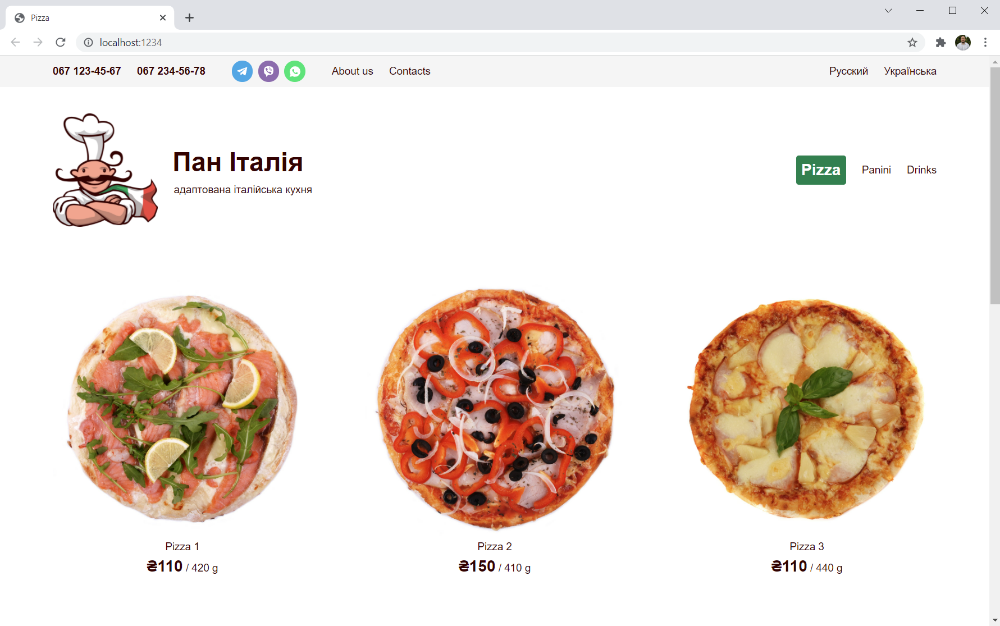
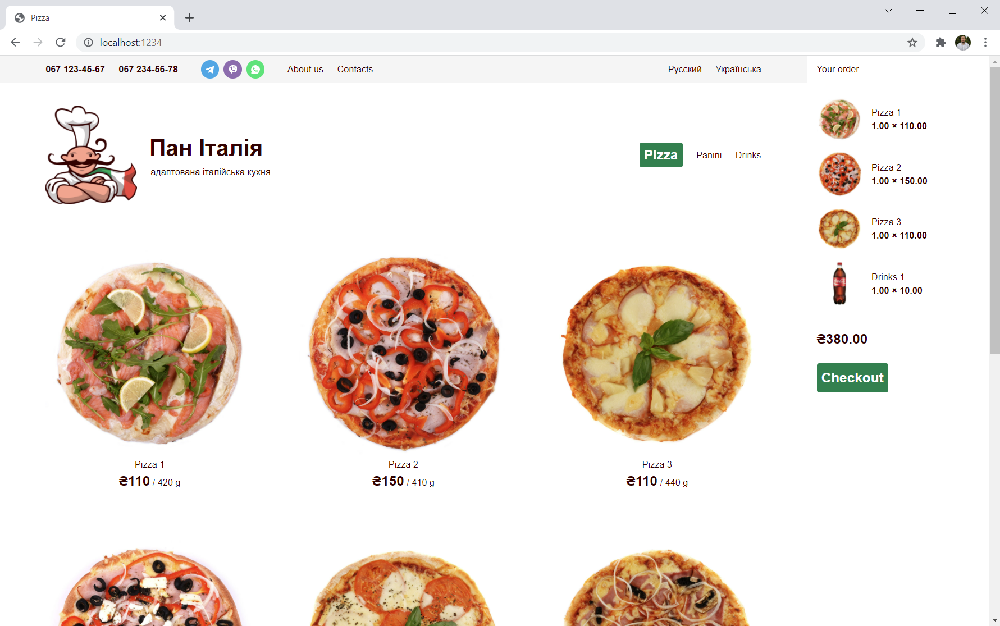

# Platformus 3.0.0-beta1 Sample Ecommerce

## Introduction

[Platformus](https://github.com/Platformus/Platformus) is free, open source, and cross-platform developer-friendly CMS
based on ASP.NET Core, [ExtCore framework](https://github.com/ExtCore/ExtCore),
and [Magicalizer](https://github.com/Magicalizer/Magicalizer).

### Sample Screenshots

*Category page (empty cart)*

*Category page (not empty cart)*

*Product page*

## Links

Live demo: http://ecommerce-demo.platformus.net/

Sources on GitHub: https://github.com/Platformus/Platformus

Website: http://platformus.net/

Docs: http://docs.platformus.net/

Author: http://sikorsky.pro/
